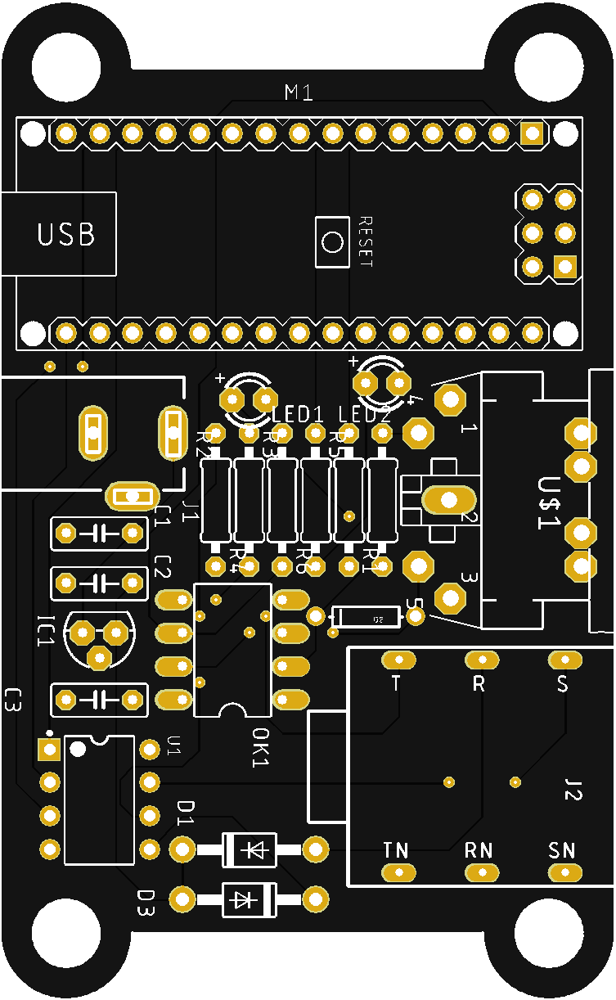
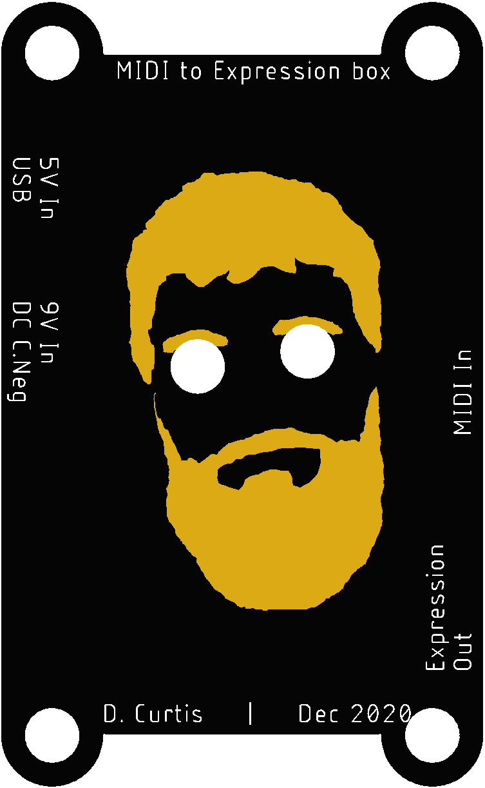

# MidiExpression
A hardware unit to add MIDI control to any device that takes an expression pedal input.

This is based on the Arduino Nano, and so only supports DIN MIDI. This project could easily be replicated with a Teensy or similar for USB support.

 

The board can be powered by:
- USB directly to the Nano
- DC barrel (centre-negative to work with guitar pedalboard PSUs)
- (Speculatively) Directly from the reference voltage on the expression input

-----

## Usage

Upon being powered on, the device will attempt to read any persistent settings. If none are found, it resets to these defaults:

| Param   | Value      |
| :---        | :---          |
| Channel | 0 (omni) |
| CC         | 4            |
| Min value | 0          |
| Max value | 127     |

These can be changed by sending a SysEx message in the following manner:

`[sysex header (0xF0)] [manufacturer ID (0x00)] [channel (0-16)] [CC] [min] [max] [sysex terminator (0xF7)]`

For example, to set channel **12**, CC **42**, with a range of **18**-**99**, the message would be (hex):

`F0 00 0C 2A 12 63 F7`

When receiving a valid sysex config message, the device will reboot to adopt the new parameters.
A hard flash reset for emergenciees can be performed by sending the following (very original) sysex message:

`F0 00 DE AD F7`
